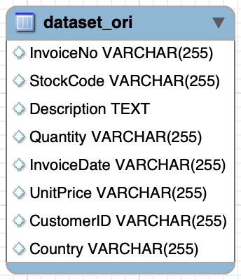
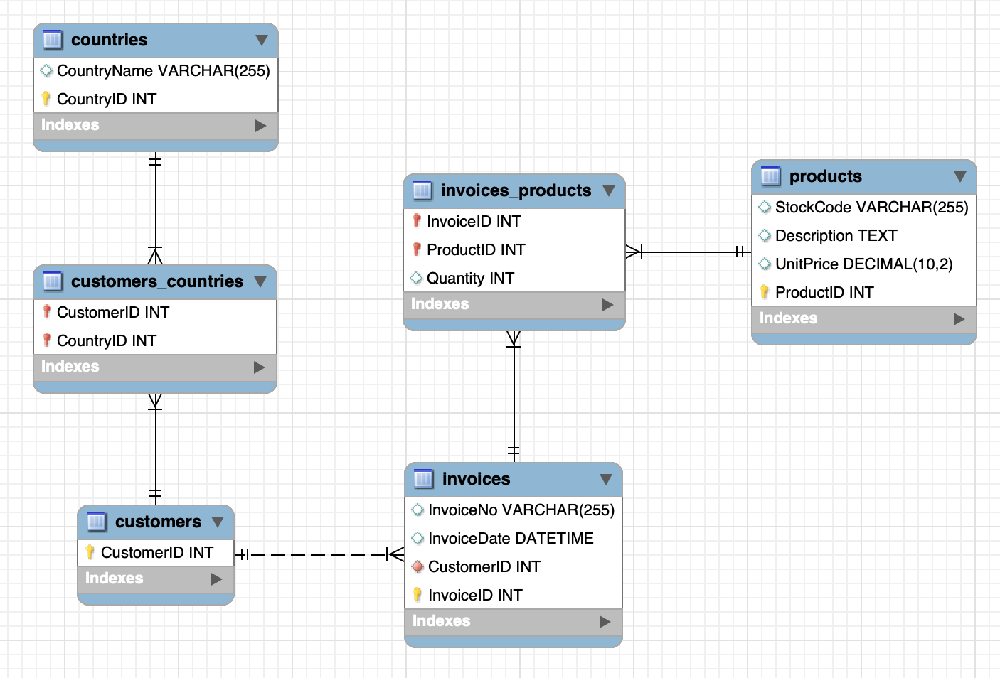

# mySQL-analytics

This project aims to create a compact MySQL database using an open-source dataset and then leverage Python to perform data analysis and insights.

This is an on-going project.

## Snippets

#### Original imported dataset structure

#### Entity relationship diagram (ERD) of database after normalization

---

## Requirements / Purpose

- Minimum Viable Product (MVP):

  - Implement a relational database with 3rd normal form normalization.
  - Utilize Python for data visualization and plotting.
  - Generate valuable insights from the dataset with visualizations.

- Project Objective:

  - Showcase and enhance MySQL proficiency.
  - Explore data visualization and plotting capabilities using Python.

- Technology Stack:
  - MySQL
  - Python, run on:
    - Jupyter Notebook
    - Google Colab

---

## Build Steps

- The dataset can be obtained from its original link or from the dataset folder.
- The "SQL queries.sql" file contains all of my sql queries, which can run on mySQL Workbench tool.
- [TBD]

---

## Approach

1.  The open-source dataset is an E-Commerce Data, obtained from [Kaggle platform](https://www.kaggle.com/datasets/carrie1/ecommerce-data/). The dataset is under the form of a csv file.
2.  The dataset is imported into a database on a local mySQL server.
3.  The database is <b>cleaned</b> and <b>normalized</b> into third form.
4.  Some insightful views are generated and exported.
5.  Those views are imported into a Jupyter Notebook file and plotted with a Python library.

---

## Known issues

- Because the obtained dataset is 1 table with no additional relational tables, unique key or foreign keys, during normalization process, there could be data loss.

---

## Change logs

### Finished

- Obtaining open-sourced dataset.
- Importing dataset into mySQL server.
- Cleaning dataset.
- Creating relational tables and normalizing database.

### In Progress

- Generating insightful views.
- Importing those views to a Jupyter Notebook file.
- Plotting visualizations with a Python library.
